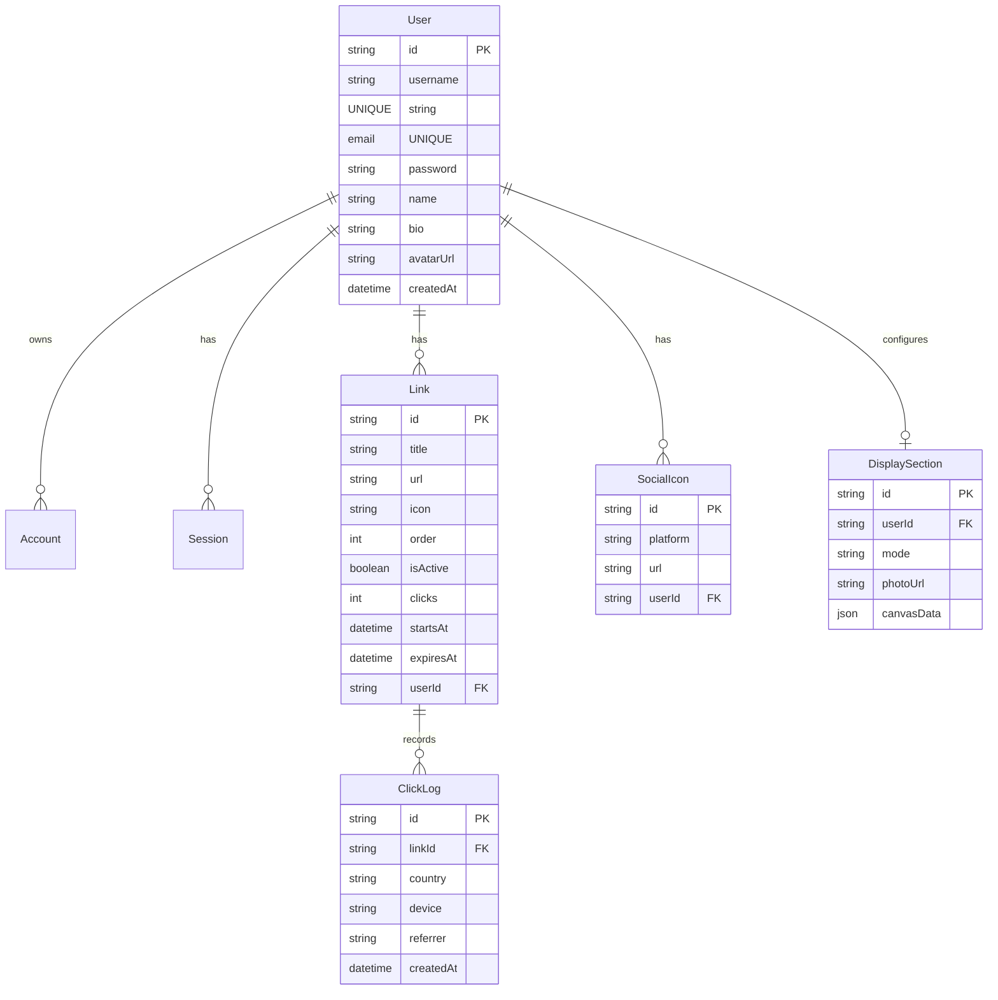

# SenLinks Project Brain & Context

Welcome to **SenLinks**! This file serves as a persistent context hub so that any AI assistant or developer can instantly understand the application's layout, stack, current state, and codebase guidelines.

---

## 🚀 Project Overview
**SenLinks** is a mobile-first, customizable "link-in-bio" platform (similar to Linktree) where users can create profiles, list their links/socials, schedule visibility windows, and view detailed click analytics.

- **Public Route**: `https://senlinks.sushanka.com.np/[username]`
- **Local Dev Server**: `http://localhost:3000`
- **Tech Stack**:
  - **Framework**: Next.js `16.2.9` (App Router)
  - **Database & ORM**: PostgreSQL (Neon Database) + Prisma Client `7.8.0`
  - **Authentication**: NextAuth `5.0.0-beta.31` (Credentials, Google OAuth, GitHub OAuth)
  - **Styling**: Tailwind CSS `v4.0.0` (using `@theme` custom variables in CSS)
  - **Drag-and-Drop**: `@dnd-kit/core` & `@dnd-kit/sortable`
  - **Charts**: `recharts` for visualization on the admin dashboard

---

## 📁 Directory Map
Here is a breakdown of the project layout and code locations:

- **[`/app`](file:///d:/webdevstuff/SenLinks/senlinks/app)** - Application views, pages, and API handlers.
  - **[`/[username]`](file:///d:/webdevstuff/SenLinks/senlinks/app/[username])** - Public-facing profile page. Fetches user links, handles scheduling, and shows social profiles.
  - **[`/admin`](file:///d:/webdevstuff/SenLinks/senlinks/app/admin)** - Protected creator workspace dashboard.
    - **[`/analytics`](file:///d:/webdevstuff/SenLinks/senlinks/app/admin/analytics)** - Analytics tab calculating total clicks, daily trends, device splits, and top country data.
    - **[`/display`](file:///d:/webdevstuff/SenLinks/senlinks/app/admin/display)** - Custom themes and layouts page (Current state: *Placeholder - Coming in Part 2*).
  - **[`/api`](file:///d:/webdevstuff/SenLinks/senlinks/app/api)** - Backend routes.
    - **`/auth`** - Auth.js routes handling sign-in actions.
    - **`/click/[id]`** - Endpoint that logs visitor location/device specs, increments click metrics, and redirects them.
    - **`/links`** - GET, POST, and PUT actions for link cards, including a reorder route.
    - **`/social`** - Operations for adding/removing social media profile icon connections.
  - **[`globals.css`](file:///d:/webdevstuff/SenLinks/senlinks/app/globals.css)** - Global styles importing Tailwind CSS v4 and declaring customized CSS variables.
  - **[`layout.tsx`](file:///d:/webdevstuff/SenLinks/senlinks/app/layout.tsx)** - Root wrapper supplying fonts and HTML tags.
  - **[`page.tsx`](file:///d:/webdevstuff/SenLinks/senlinks/app/page.tsx)** - Home marketing landing page highlighting key features and CTAs.
- **[`/components`](file:///d:/webdevstuff/SenLinks/senlinks/components)** - Modular client/server React components.
  - **`AdminLinkForm.tsx`** - Dialog window to create or modify link details (URL, title, schedule window dates).
  - **`AnalyticsChart.tsx`** - Graph configurations rendering charts for click data.
  - **`LinkCard.tsx`** - Draggable list item displaying individual links with toggles and action controls.
  - **`SocialIconRow.tsx`** - Small link array displaying active platforms (e.g. YouTube, Twitter).
- **[`/lib`](file:///d:/webdevstuff/SenLinks/senlinks/lib)** - Service and utility helpers.
  - **`auth.ts`** - Full NextAuth options configuration for credentials-based login and Google/GitHub providers. Includes unique username generator helper.
  - **`prisma.ts`** - Single instance initializer for Prisma client.
  - **`rate-limit.ts`** - sliding-window IP rate limiter designed to prevent fake analytic hits.
- **[`/prisma`](file:///d:/webdevstuff/SenLinks/senlinks/prisma)** - Database definition folder.
  - **`schema.prisma`** - Database schema mapping user roles, credentials, profile links, click statistics, and design displays.

---

## 🗄️ Database Models
The database uses **PostgreSQL** configured via **Prisma**. Below is the entity relationship layout:



---

## ⚡ Key Workflows

### 1. Link Redirect & Click Tracking Pipeline
Whenever a public user clicks an active link, the system routes through `/api/click/[id]`:
```
[User Clicks Link] 
       │
       ▼
[/api/click/[id]]
       │
       ├─► [Check in-memory Rate Limiter per IP/Link]
       │         │
       │         ├─► (Allowed) ──► Log click info (device, country, referrer) & Increment link clicks count in DB
       │         └─► (Rate Limited) ──► Skip DB log (prevents bot spam)
       │
       ▼
[Redirect user to destination URL]
```

### 2. Authentication Flow
- **Providers**: Credentials (Email/Password), Google OAuth, GitHub OAuth.
- **Username Generation**: When an OAuth user registers, `generateUniqueUsername` is triggered in the `signIn` callback. It sanitizes the name, checks for availability, appends random digits if needed, and stores the user under a distinct handle.

---

## 🛠️ How to Develop
1. **Launch Dev Server**:
   ```bash
   npm run dev
   ```
   *Note: Runs Next.js server with Webpack integration enabled (`next dev --webpack`).*

2. **Sync Database Changes**:
   If changes are made to `prisma/schema.prisma`:
   ```bash
   npx prisma db push
   npx prisma generate
   ```

---

## 📝 Guidelines for AI Code Modifications
When asked to perform tasks or resolve bugs:
1. **Next.js & React 19 standards**: Always write server components where possible, utilizing client components (`"use client"`) only for interactive controls, state, and Hooks.
2. **Tailwind CSS v4**: Theme values (colors, margins, borders) must be configured or modified in the `@theme` block of `app/globals.css`. Do not add configuration files like `tailwind.config.js`.
3. **Database Operations**: Perform database mutations in transactions (e.g. `prisma.$transaction`) when doing multi-row updates (e.g. click logging + counter increments, reordering list indices).
4. **Maintenance of this File**: When completing a task, updating schemas, or adding new routes, make sure to update this `brain.md` file accordingly!
